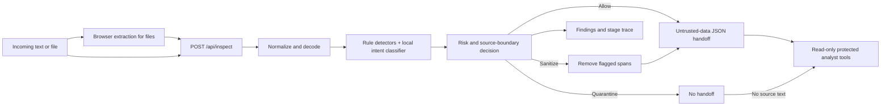

# PromptGuard Studio: structural architecture

## Problem and outcome

The protected agent must not treat text from a user message, retrieved page, document, email, tool response, code, or image as a replacement for its own instructions. PromptGuard is inserted between intake and agent context. It returns a reviewable decision and a safe handoff string. A bounded local analyst then runs read-only indexing, evidence search, and extractive answer tools over that handoff. It does not call an LLM or external service.

## Process flow and key decisions

1. **Intake.** The UI accepts pasted text or one local file. PDF.js extracts PDF text; Mammoth reads DOCX; Tesseract.js reads images and scanned PDF pages. Text, Markdown, HTML, email, JSON, and code files are read as text. Extraction happens in the browser; the extracted text is then sent to the app's inspection endpoint. Files over 12 MB, PDFs over 30 pages, and extracted text over 50,000 characters are rejected with a recoverable message. Uploaded bytes are not saved by the app.
2. **Normalize.** The server normalizes Unicode compatibility forms, removes zero-width characters, decodes common HTML entities, and checks candidate Base64, URL-encoded, and ROT13 text. Decoded instructions are analyzed in addition to visible text. The original input is retained only within the request so evidence spans can be related back to it.
3. **Inspect.** Reviewable rules recognize nine attack categories: instruction override, role change, secret extraction, tool abuse, credential theft, context poisoning, multi-step jailbreak, encoded instructions, and indirect prompt injection. The local instruction-intent model is a compact binary text classifier trained on 30 synthetic attack and 30 benign phrases at startup. It supplies a second signal for agent-directed commands and can flag a strong unmatched candidate for review. The model uses word and bigram frequencies; no remote model or secret key is needed. Clearly framed educational discussion is treated differently from operational directions.
4. **Decide.** Findings carry category, reason, evidence, span, severity, confidence, and inspection layer. The highest severity, distinct attack categories, and external-source boundary determine a bounded risk score. Content with no findings is allowed. When findings exist, flagged spans are removed. If high-risk content leaves almost nothing useful, the entire input is quarantined. Otherwise the safe remainder is allowed through as sanitized content.
5. **Handoff and protected analyst.** Allowed or sanitized text is wrapped as JSON data with an explicit untrusted-content instruction. For quarantine, `safeHandoff` is null. The inspection endpoint calls the analyst with only this server-created field and a separate trusted user question, never the raw `content`. The analyst invokes three local read-only tools: index approved passages, search for question-relevant evidence, and compose an extractive answer with citations. If the question has no matching evidence, it declines to answer; on quarantine it receives zero characters and returns a blocked state. It does not call a language model, browse, or use external data. The UI shows the decision, evidence, stage trace, analyst answer and tool trace, and a downloadable JSON report for review.

## Trust boundaries

- The browser is an intake and extraction surface. The server's `/api/inspect` response is authoritative for the decision.
- The browser cannot submit a handoff to the protected analyst. The endpoint creates it from the inspection result on the server and invokes `runProtectedAgentDemo(inspection.safeHandoff, question)`.
- Content from web pages, PDFs, emails, documents, API results, OCR, and code is lower-trust data. Its source label is provided by the trusted caller, never inferred from instructions within the content.
- The endpoint does not execute tool calls, browse attacker URLs, read system prompts, or access credentials. Detection examples use fictional markers and `.invalid` domains.
- The app does not intentionally persist payloads or reports. JSON reports are generated in the user's browser on request. A production agent should add authentication, source provenance, rate limits, privacy review, and independent tool authorization appropriate to its deployment.
- The handoff boundary is defense in depth, not a substitute for model-level isolation or least-privilege tools. An undetected attack could still influence a downstream model.

## Technical layout

| Component | Location | Responsibility |
| --- | --- | --- |
| Product UI | `app/page.tsx`, `components/` | Intake, examples, results, fixture coverage, architecture |
| File extraction | `lib/extract-file.ts`, `public/ocr/` | Browser-side PDF, DOCX, image OCR, and text extraction |
| Inspection endpoint | `app/api/inspect/route.ts` | Validate input and return an inspection without storage |
| Firewall | `lib/firewall.ts` | Normalization, decoded variants, findings, risk, redaction, handoff |
| Intent model | `lib/intent-model.ts` | Local statistical instruction-intent signal |
| Protected analyst | `lib/protected-agent.ts` | Read-only evidence tools and cited answer from the server-created safe handoff only |
| Fixture evaluator | `lib/fixtures.ts`, `app/api/evaluate/route.ts` | Repeatable attack and benign demonstrations |
| Browser agent tool | `app/page.tsx` | Optional WebMCP `inspect_content` action using the same API and visible state |

## Claim on the hackathon grid

**F3 / D1.** F3 requires at least seven attack types; the current fixture suite identifies all nine named categories in one representative attack each. D1 is the defensible depth claim: structured and textual inputs are the primary supported mode and the controlled set gives acceptable outputs. PDF, DOCX, and OCR inputs are implemented, but the prototype has not been tested on a broad multimodal corpus or demonstrated the reliability needed to claim D2 or D3. The `Coverage` view and [EVALUATION.md](./EVALUATION.md) provide the evidence for this claim.

## Known limits and next validation

The rules and small local model can miss paraphrases, cross-document attacks, adversarial typography, and novel encodings. A sentence with legitimate and malicious content may be redacted more broadly than needed. OCR quality depends on source resolution. The fixture set is intentionally small and curated, so its results cannot estimate deployment precision or recall. Before use with a real agent, evaluate an independent labeled corpus, add adversarial tests, monitor false positives, and enforce separate approval for high-impact tools.
